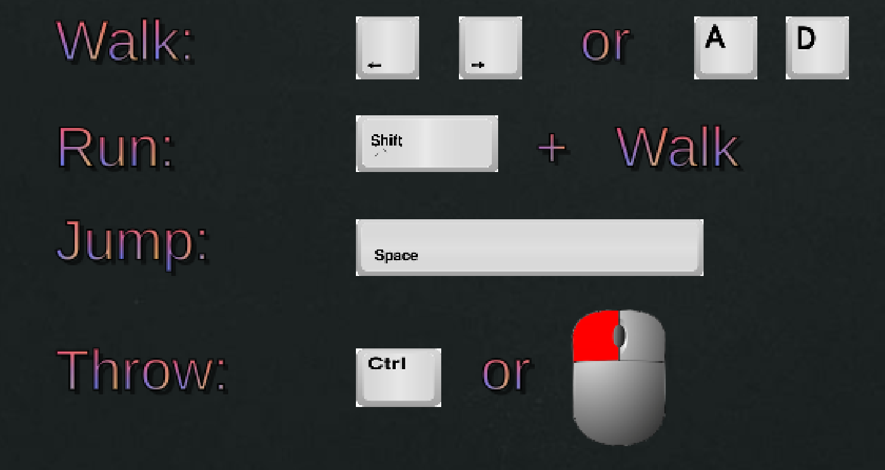

# Game Basic Information #

## Summary ##

** The Struggle **

Created by Isabel Kalogiannis, Marcos Alcantar, Jill Parodi, Margaret Sit, and Leander Ty

Have you ever experienced those bike traffic-ridden, hectic campus commutes to your classes during your time at UC Davis? Well, through this game you will experience and relive those moments again! Rush to class as you avoid bikers and bikers in this 2D platformer that was inspired by the classics, like Super Mario Bros! Beat the timer and make it to class on time to avoid losing those precious clicker points and save your grade!

## Gameplay explanation ##

**In this section, explain how the game should be played. Treat this like a manual within a game. It is encouraged to explain the button mappings and the most optimal gameplay strategy.**

# Main Roles #

Your goal is to relate the work of your role and sub-role in terms of the content of the course. Please look at the role sections below for specific instructions for each role.

Below is a template for you to highlight items of your work. These provide the evidence needed for your work to be evaluated. Try to have at least 4 such descriptions. They will be assessed on the quality of the underlying system and how they are linked to course content. 

*Short Description* - Long description of your work item that includes how it is relevant to topics discussed in class. [link to evidence in your repository](https://github.com/dr-jam/ECS189L/edit/project-description/ProjectDocumentTemplate.md)

Here is an example:  
*Procedural Terrain* - The background of the game consists of procedurally-generated terrain that is produced with Perlin noise. This terrain can be modified by the by the game at run-time via a call to its script methods. The intent is to allow the player to modify the terrain. This system is based off the component design pattern and the procedural content generation portions of the course. [The PCG terrain generation script](https://github.com/dr-jam/CameraControlExercise/blob/513b927e87fc686fe627bf7d4ff6ff841cf34e9f/Obscura/Assets/Scripts/TerrainGenerator.cs#L6).

You should replay any **bold text** with your own relevant information. Liberally use the template when necessary and appropriate.

## User Interface

**Describe your user interface and how it relates to gameplay. This can be done via the template.**

## Movement/Physics

The implementation of the movement conventions was closely tied to how the input was implemented. We used Unity’s 2D physics system and tweaked the values of variables to accomplish a weighty feel to the character’s movement while also letting the player have fair amount of control. By using what we learned from the command pattern exercise in our first assignment, we were able to separate movement for each button input. This allowed us to focus on implementing a jump that could be controlled based on how long the jump button was held. To implement that, we used a [video tutorial](https://www.youtube.com/watch?v=7KiK0Aqtmzc) and we altered the values of the player’s rigidbody velocity when we detected vertical movement. We made the jump up take longer than the fall to give a controlled jump with a weighty feel just like how Mario games do so. The gravity scale on the player was also doubled to make the falling faster.

We limited the player to one jump, and to prevent any more jumps from being inputted and breaking the movement conventions, we created states to handle inputs for different states. The three basic states included being grounded, jumping, and getting hurt. The hurt state was necessary to add knockback movement to indicate to the player that damage was dealt. Applying knockback was simply a matter of pushing the player away from an enemy using the rigidbody’s AddForce function, along with setting the velocity to 0 when hit and when landing on the ground again to keep the movement consistent. 

For handling collisions between the player and the level, we used the Box Collider 2D component paired with the rigidbody and we added a physics material to the player that gave it a friction value of 0 to allow some slipping when landing from jumps. This also allowed the player to do full jumps when also pushing against a wall. However, this resulted in a bug that we weren’t able to address in time that caused to player to keep slipping along the ground when pushed by an enemy. 

Better Jump Video Tutorial: https://www.youtube.com/watch?v=7KiK0Aqtmzc

## Animation and Visuals

**List your assets including their sources, and licenses.**

**Describe how your work intersects with game feel, graphic design, and world-building. Include your visual style guide if one exists.**

## Input

**Describe the default input configuration.**

**Add an entry for each platform or input style your project supports.**

## Game Logic

**Document what game states and game data you managed and what design patterns you used to complete your task.**

# Sub-Roles

## Audio

For audio, we chose to have retro-style 8-bit sound effects to compliment the visual style of the game. These type of sound effects are closely associated to older arcade games, including classic platformers like Super Mario Bros., Metroid, and Castlevania. We thought the pixel art assets and these type of sound effects would compliment each other well. They helped give the players an arcade-like experience and the feeling that they’re playing a game in the style of these old classics. The background music was a short and fun-sounding bossa nova loop that we felt would add a little more personality. 

To implement the audio system, we created an audio manager script that was attached to a centralized game object that contained other manager scripts for health, the HUD, and UI buttons. The audio manager contains a list of all of the audio clips for the sound effects and the music in the game. This made it easier to search the list and play any sound that we wanted to from any other scripts in the game. The list was made public so that we could add the sounds manually and change their properties, like volume and pitch, in the editor. To implement this list of sounds, we also created a wrapper class for Unity’s audio clips to allow us to change their properties in the editor. This manager implementation was taken from an online video tutorial.

References and Assets:

Video tutorial used for Audio Implementation: https://www.youtube.com/watch?v=6OT43pvUyfY&t=40s

Sound Effects (Created by ZapSplat, Standard Liscence): https://www.zapsplat.com/page/11/?s=footstep&post_type=music&sound-effect-category-id

Bossa Nova Theme Loop: https://freesound.org/people/Mrthenoronha/sounds/371844/

## Gameplay Testing

**Add a link to the full results of your gameplay tests.**

**Summarize the key findings from your gameplay tests.**

## Narrative Design

**oDocument how the narrative is present in the game via assets, gameplay systems, and gameplay.** 

## Press Kit and Trailer

**Include links to your presskit materials and trailer.**

**Describe how you showcased your work. How did you choose what to show in the trailer? Why did you choose your screenshots?**

## Game Feel

**Document what you added to and how you tweaked your game to improve its game feel.**
