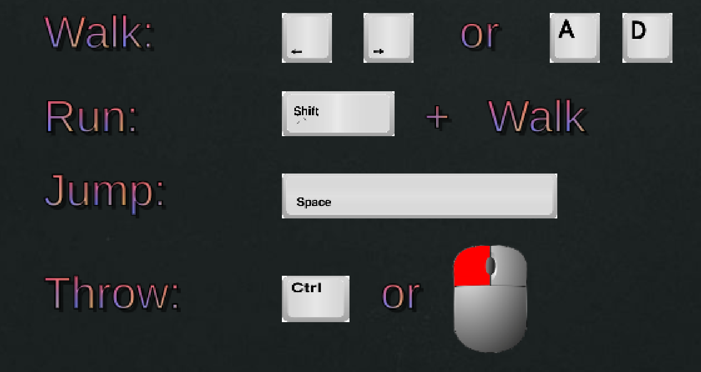
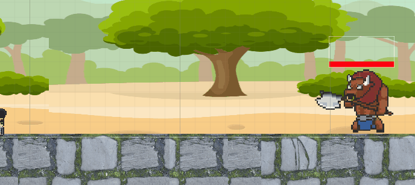
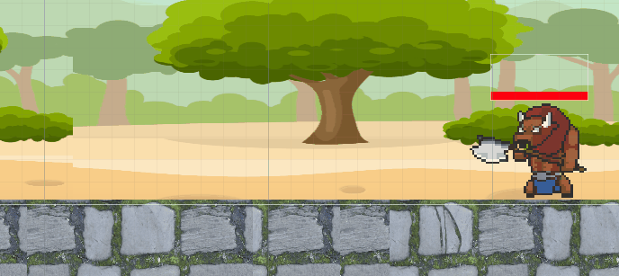
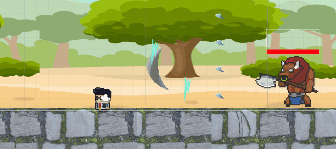

# Game Basic Information - The Struggle #

## Summary ##

** The Struggle **

Created by Isabel Kalogiannis, Marcos Alcantar, Jill Parodi, Margaret Sit, and Leander Ty

Have you ever experienced those bike traffic-ridden, hectic campus commutes to your classes during your time at UC Davis? Well, through this game you will experience and relive those moments again! Rush to class as you avoid bikers and squirrels in this 2D platformer that was inspired by the classics, like Super Mario Bros! Beat the timer and make it to class on time to avoid losing those precious clicker points and save your grade!

## Gameplay explanation ##

The controls are explained below. You have to run instead of walk to be able to pass certain parts of the level such as  
shift-run-jumping to platforms to be able to jump over the wall.  You have to throw books using ctrl or the left mouse button to fight squirrels and the boss before the end of the level.

# Main Roles #
## User Interface - (Isabel)  
**Start Menu** - I created a scene called StartMenu that contains the title of our game (The Struggle), a button that says PLAY that takes you to the gameplay, a button that says CONTROLS that take you to the scene called Controls. For the design of the text on the menu I went to the Assets Store and downloaded TextMeshPro which made it so the text could have more design. I created a [gradient of 4 colors](https://github.com/isaboi/ECS189L_GameProject/blob/master/ECS189%20Game%20Project/Assets/UI/Play%20Button%20Color%20Gradient.asset) that all of the text on the menus use. The buttons on the menu make a scene switch occur so a [script called StartMenu.cs](https://github.com/isaboi/ECS189L_GameProject/blob/master/ECS189%20Game%20Project/Assets/Scripts/MainMenu.cs) was needed for that to happen. When you press PLAY the scene switches to TestLevel and when you press CONTROLS the scene switches to Controls. The main menu also has the credits at the bottom mentioning that the game was made by us: Isabel, Marcos, Jill, Margaret, and Leander. 
[Reference used to make Menu](https://www.youtube.com/watch?v=zc8ac_qUXQY&t=1s).  

**Countdown Timer** - I created a [script called CountdownTimer.cs](https://github.com/isaboi/ECS189L_GameProject/blob/master/ECS189%20Game%20Project/Assets/Scripts/CountdownTimer.cs) that controls what a UI text element displays on the screen. First I created the UI text element which starts out by displaying "Time Left: 60" in the top right corner of the screen. I then attached the script to it which decreases the number by 1 ever second. Once the countdown timer reaches 0, the player "dies" and the scene changes to show to the player that they lost and must try again. I also made sure that the size and location of the countdown timer were in a location that feels natural to the player. This location was visibly in the upper right hand corner at a medium sized font.  
[Reference used to make countdown timer](https://www.youtube.com/watch?v=RLKQhpDxDlE&t=2s).  

**Health Bars** - Besides the player's health bar at the top left of the screenn, we decided we wanted a health bar above the boss' (Gunrock's) head so that you know how closer you are to beating him during the fight. We chose to have the bar above his head because the player would less likely notice a new health bar appearing at the top of the screen if that is where we had chosen to place it instead. I created a UI image element for the red health bar slider and the fill of it decreased down towards zero based off some lines of code that I added to the [boss controller script called BossController.cs](https://github.com/isaboi/ECS189L_GameProject/blob/master/ECS189%20Game%20Project/Assets/Scripts/BossController.cs#L111). One was the [image instance seen here](https://github.com/isaboi/ECS189L_GameProject/blob/fb106b38ed24bf6e7ae0907c8f546c4c994efe82/ECS189%20Game%20Project/Assets/Scripts/BossController.cs#L34) and the other was the [fill of the bar change seen here](https://github.com/isaboi/ECS189L_GameProject/blob/fb106b38ed24bf6e7ae0907c8f546c4c994efe82/ECS189%20Game%20Project/Assets/Scripts/BossController.cs#L111).  All of these UI elements I created really helped solidify how different components in Unity work together, whether it be how a script can interact with a UI element or something else.  
[Reference used to make health bar](https://www.youtube.com/watch?v=UKs1qO8w7qc).  

**Controls Menu** - Part of the Controls menu can be seen at he beginning of this project document. The only thing left out of that screenshot above is a button that says "Back to Menu" that brings you back to the start menu after you click it after learning the controls of the game. To make this menu I added many UI image elements with pictures of the computer keyboard keys or mouse clicks you would need to play the game properly. They are listed out as walk, run, jump, and throw, which are the 4 different commands. I decided to display the command for "run" by showing the shift key and then "+ walk" after that so that the run command wasn't cluttered with a lot of different key options. I believed this was satisfactory explanation on how to run because you already know the command to walk from the line above and then if you add the shift key to that, then you run. [Here is the Controls menu scene](https://github.com/isaboi/ECS189L_GameProject/blob/master/ECS189%20Game%20Project/Assets/Scenes/Controls.unity).

## Movement/Physics - (Marcos)

The implementation of the movement conventions was closely tied to how the input was implemented. We used Unity’s 2D physics system and tweaked the values of variables to accomplish a weighty feel to the character’s movement while also letting the player have fair amount of control. By using what we learned from the command pattern exercise in our first assignment, we were able to separate movement for each button input. This allowed us to focus on implementing a jump that could be controlled based on how long the jump button was held. To implement that, we used a [video tutorial](https://www.youtube.com/watch?v=7KiK0Aqtmzc) and we altered the values of the player’s rigidbody velocity when we detected vertical movement. We made the jump up take longer than the fall to give a controlled jump with a weighty feel just like how Mario games do so. The gravity scale on the player was also doubled to make the falling faster.

We limited the player to one jump, and to prevent any more jumps from being inputted and breaking the movement conventions, we created states to handle inputs for different states. The three basic states included being grounded, jumping, and getting hurt. The hurt state was necessary to add knockback movement to indicate to the player that damage was dealt. Applying knockback was simply a matter of pushing the player away from an enemy using the rigidbody’s AddForce function, along with setting the velocity to 0 when hit and when landing on the ground again to keep the movement consistent. 

For handling collisions between the player and the level, we used the Box Collider 2D component paired with the rigidbody and we added a physics material to the player that gave it a friction value of 0 to allow some slipping when landing from jumps. This also allowed the player to do full jumps when also pushing against a wall. However, this resulted in a bug that we weren’t able to address in time that caused to player to keep slipping along the ground when pushed by an enemy. 

Better Jump Video Tutorial: https://www.youtube.com/watch?v=7KiK0Aqtmzc

## Animation and Visuals - (Jill)

For the visuals of our game, we had to find art assets that were applicable to our narrative as well as creating the animation for it. As soon as we came up with a game idea, a 2D side- scroller platformer game, and a plot, a student attempting to get to class on time, we had to find 2D art assets that included the background, the player, the ground, and the objects and enemies.

By making the game a bit personal in terms of having it take place at “UC Davis” and incorporating squirrels and bicycles, things we see everyday on campus, it created an element of **game feel** or juiciness to our game. With that, game feel was present in our game in the form of aesthetics. As I mentioned above, the familiarity creates a sort of satisfaction for the player. By creating a familiar environment within the game, the game juice becomes more personal and emotional. In addition to the visuals, the auditory input has the ability to make the game feel more realistic especially when the player moves and you hear his footsteps against the cobblestone grounds as well as the jump sound. There was also an addition to pixelated dogs that were helplessly stuck in trees. We incorporated this because we thought it would be amusing to see as it is unavoidable when the player is jumping on the cobble blocks. We thought it was important to not take our game too seriously and ultimately have fun with it by integrating our own personalities into the game. 

Moreover, the **graphic design** was made possible through the animator tool in Unity that made the sprites display smooth transitions when the character, enemies, and bicycles moved. It helped to find sprites that displayed movement transitions (idle, walking, sprinting, jumping) so that you could easily apply it to the animation tool in Unity. Tying all the elements in our design together made it feel complete, as if each element in the design belonged there. Everything in the game was calculated because we wanted the design to be instantly recognizable and we achieved this through our graphic design. 

In regards to **world building**, our game was heavily influenced by Super Mario Bros so as we were discussing ideas, the game design of Super Mario Bros was our framework. Constructing the imaginary world entailed a simple, yet solid idea that was left for us to execute. This included having an aesthetically pleasing parallax background and cute animations, such as the squirrels, even though they were killer squirrels.

Ultimately, it was important for us to make the game entertaining, enjoyable, and creative and the visual representation of the game was critical in regards to this. We spent some time deciding how we wanted our game to be and how we could make it stand apart from other games. Through the incorporation of all the gameplay systems, software design  patterns and working collaboratively and effectively, we were able to bring our ideal game to fruition.

## Input - (Margaret)

#### Platform and Input Styles
Our project supports Unity Game version 2018.3.11f1 on PC, Mac, and Linux Standalone Windows platform. Our project support the input style of keyboard and mouse.

We used what we learn from command pattern exercise in our first assignment to separate movement for each button input. 

#### IPlayerCommand (IPlayerCommand.cs)
IPlayerCommand script is the interface to the command pattern for executing a command. IPlayerCommand includes the Execute method that takes a game object which executes the command. 

#### PlayerController (PlayerController.cs)
PlayerControlller script is the overall script that uses the command pattern to manage input. 

### Inputs
During the main gameplay, the inputs for the game are the following: 

Walk using the Left Arrow and Right Arrow or the A and D keys.

Run using the Shift Key while also pressing down the inputs for Walk.

Jump using the Space Key.

Throw using the Ctrl Key or Left Mouse button.

PlayerController script maps all input commands to IPlayerCommand Scripts that implement the Execute method.

An instance of the IPlayerCommand MovePlayerLeftMovement is bound to Player’s Input.GetAxis with axis Horizontal that is mapped to Left Arrow or A Key and implements left movement for Walk.

An instance of the IPlayerCommand MovePlayerRightMovement is bound to Player’s Input.GetAxis with axis Horizontal that is mapped to Right Arrow or D Key and implements right movement for Walk.

Player’s Fire3 input is mapped to Shift Key and implements speed up of Player’s left and right movement for Run within the MovePlayerLeftMovement and MovePlayerRIghtMovement.

An instance of the IPlayerCommand MovePlayerJumpMovement is bound to Player’s Jump input that is mapped to Space Key and implements jump movement.

Player’s Fire1 input is mapped to Ctrl Key or Left Mouse button and use to implement Throw. 
When the PlayerController detects the Fire1 input, a new projectile is instantiated for a player to shoot with its velocity and lifespan set in PlayerController and ProjectileController.	

### Input States
We also created multiple states to handle the inputs for different states. The states included being grounded, jumping, getting hurt, left direction, and right direction. 

State Grounded is used to handle the Jump input to make sure the jump movement can only be executed when the player is on the ground.

State Jumping indicates that the player is jumping and prevents doing another jump while in the air. 

State Hurt is used to with instances of the IPlayerCommands MovePlayerKnockbackRight and MovePlayerKnowbackLeft to add knockback movement in appropriate direction and indicate that damage was dealt when the player collides with an enemy. This interacts with the UI/HUD by calling method Damage() to deal with damage and method UpdateHealth() to update the health bar. This also interacts with GameManager to change the scene to Lose if the player runs out of health after updated damage.  

States Left and Right is used to determine the direction to set the velocity of the projectile. We wanted the player to shoot the project in same direction it is facing. 

Player starts in Grounded state. When the Jump input is detected and state is Grounded, then the state can change from Grounded to Jumping. The state can change to Hurt when player collides with enemy. The state can change back to Grounded when the player is touching the ground. Left and Right States are set when PlayerController determines left and right movement.

The IPlayerCommands and states are used in PlayerController. In the update function, the PlayerController gets the input from the keyboard and looks for the appropriate IPlayerCommand to handle and execute the command based on the states and also collision detection.

#### Main Menu and Control Screen
Main menu takes as input the Left Mouse button where the Player can choose between playing the game and navigating to the control screen to see the controls. The control screen takes as input Left Mouse button to go back to Main menu.

#### References to Scripts 
[IPlayerCommand](https://github.com/isaboi/ECS189L_GameProject/blob/1ad1a81857f3214cf5df48a2a2e7dce116cfb6c1/ECS189%20Game%20Project/Assets/Scripts/IPlayerCommand.cs#L5).

[PlayerController](https://github.com/isaboi/ECS189L_GameProject/blob/1ad1a81857f3214cf5df48a2a2e7dce116cfb6c1/ECS189%20Game%20Project/Assets/Scripts/PlayerController.cs#L7).

[MovePlayerLeftMovement](https://github.com/isaboi/ECS189L_GameProject/blob/1ad1a81857f3214cf5df48a2a2e7dce116cfb6c1/ECS189%20Game%20Project/Assets/Scripts/MovePlayerLeftMovement.cs#L9).

[MovePlayerRightMovement](https://github.com/isaboi/ECS189L_GameProject/blob/1ad1a81857f3214cf5df48a2a2e7dce116cfb6c1/ECS189%20Game%20Project/Assets/Scripts/MovePlayerRightMovement.cs#L9).

[MovePlayerJumpMovement](https://github.com/isaboi/ECS189L_GameProject/blob/1ad1a81857f3214cf5df48a2a2e7dce116cfb6c1/ECS189%20Game%20Project/Assets/Scripts/MovePlayerJumpMovement.cs#L6).

[MovePlayerKnockbackLeft](https://github.com/isaboi/ECS189L_GameProject/blob/1ad1a81857f3214cf5df48a2a2e7dce116cfb6c1/ECS189%20Game%20Project/Assets/Scripts/MovePlayerKnockbackLeft.cs#L5).

[MovePlayerKnockbackRight](https://github.com/isaboi/ECS189L_GameProject/blob/1ad1a81857f3214cf5df48a2a2e7dce116cfb6c1/ECS189%20Game%20Project/Assets/Scripts/MovePlayerKnockbackRight.cs#L5).

[ProjectileController](https://github.com/isaboi/ECS189L_GameProject/blob/1ad1a81857f3214cf5df48a2a2e7dce116cfb6c1/ECS189%20Game%20Project/Assets/Scripts/ProjectileController.cs#L5).

[HUDManager](https://github.com/isaboi/ECS189L_GameProject/blob/1ad1a81857f3214cf5df48a2a2e7dce116cfb6c1/ECS189%20Game%20Project/Assets/Scripts/HUDManager.cs#L6).

[HealthManager](https://github.com/isaboi/ECS189L_GameProject/blob/1ad1a81857f3214cf5df48a2a2e7dce116cfb6c1/ECS189%20Game%20Project/Assets/Scripts/HealthManager.cs#L5).

[GameManager](https://github.com/isaboi/ECS189L_GameProject/blob/1ad1a81857f3214cf5df48a2a2e7dce116cfb6c1/ECS189%20Game%20Project/Assets/Scripts/GameManager.cs#L7).

## Game Logic - (Leander)

### General Game Logics:

#### Scene Manager(GameManager.cs)

The scene management was done using a singleton class in the GameManager.cs. As a singleton class and not a monobehaviour, the manager could exists outside a scene and would survive changes in the scene. The game manager used the scene management unity system to facilitate scene changing.

A scene change would be called using:

GameManager.Instance.ChangeScene("Scene Name");

##### Timeout

For the win and lose screen, a timeout.cs script is attached to the main cameras of each scene. It switches back to the main menu after a certain time using the changescene call.

#### Health Manager(HealthManager.cs) 

The health manager utilized the publisher-subscriber model. It contains a dictionary private field that takes a integer key and a double health value. This holds the health of every game object that would need a health irrespective if they are an ally or an enemy. 

To add health to a game object, do the following steps:

1. In the gameobject, add a private field with the Health Manager Type. Example: private HealthManager healthManager;

2. In the Awake() function, find and save the healthManager in your file system to the newly created field. Example:        this.healthManager = GameObject.FindGameObjectWithTag("Manager").GetComponent<HealthManager>();
  
3. Add a integer private field so we can save the key returned by the Add(double desiredhealth) of the HealthManager class. Example:        key = this.healthManager.Add(Health);
This key will a unique identifier to the game object and it will be used for interacting with the health manager.

4. Finally, dealing damage to the key holder would occur by calling the health manager function called Damaged(int key,double damage).
Example: this.healthManager.Damaged(key, 5.0);
Damaged() will return the current health.
If the damage kills the keyholder, the key/damage pair will be deleted from the dictionary and 0 will be returned as current health.

### Projectile Controllers:

#### BossProjectileController & ProjectileController(Players)

The projectile controllers are attached to each projectile prefabs. Both have the same functions. The controllers have a lifeTime and a currentLife fields that initialized in the awake function and also serve the purpose of dictating the life span of the projectile. The Update() function interates over the currentLife field. Once it reaches the lifeTime field in value, the projectile is deleted. The projectiles also have a OnTriggerEnter2D function that detects collision with the opposite faction(Player detects for Enemy and vice versa) or ground. If it is triggered, the object is destroyed. I decided to do a projectile script so the projectiles could timeout when not needed anymore.

### Boss Mechanics:

The Boss is controlled by the BossController. The controller handles the boss attacks, damage detection, and animations. The Boss uses the health manager to manage its health. Damage detection is done with trigger collision and the use of tags.

#### Attack Descriptions:

Each attack follows its own timer to decide when to activate.

##### Attack 1: AOE Spread Attack

##### Attack 2: Single Large Swing Attack

##### Attack 3: Slow, but deadly lightning Attack
Attack 3 does a delay attack. With an attack cycle of 2 sec, the attack saves the position at time 0, then at time 2, it attacks at the position.

#### Boss Enter/Exit

The Boss also utilizes a Boss Room Controller. Around the boss, there is a box collider 2D that detects if the player has entered the area. In the BossRoomController, the OnTriggerEnter and OnTriggerExit functions sets the value of a boolean field. The BossController accesses this field to check if it can set its own Active field. If the Active field is set to true, the Boss attacks. If its false, the boss does not. This check is done on every update.

#### Miscellaneous Contribution:

##### Triggers and Stuff:

###### Win Trigger(WinTrigger Prefab w/ script)

The win trigger uses a single trigger collider that detects the player. After detecting the player, the change scene function is called.

###### Fall Trigger(FallDetector w/ script)

The fall trigger uses a single trigger collider that detects the player. After detecting the player, the change scene function is called.

# Sub-Roles

## Audio - (Marcos)

For audio, we chose to have retro-style 8-bit sound effects to compliment the visual style of the game. These type of sound effects are closely associated to older arcade games, including classic platformers like Super Mario Bros., Metroid, and Castlevania. We thought the pixel art assets and these type of sound effects would compliment each other well. They helped give the players an arcade-like experience and the feeling that they’re playing a game in the style of these old classics. The background music was a short and fun-sounding bossa nova loop that we felt would add a little more personality. 

To implement the audio system, we created an audio manager script that was attached to a centralized game object that contained other manager scripts for health, the HUD, and UI buttons. The audio manager contains a list of all of the audio clips for the sound effects and the music in the game. This made it easier to search the list and play any sound that we wanted to from any other scripts in the game. The list was made public so that we could add the sounds manually and change their properties, like volume and pitch, in the editor. To implement this list of sounds, we also created a wrapper class for Unity’s audio clips to allow us to change their properties in the editor. This manager implementation was taken from an online video tutorial.

References and Assets:

Video tutorial used for Audio Implementation: https://www.youtube.com/watch?v=6OT43pvUyfY&t=40s

Sound Effects (Created by ZapSplat, Standard Liscence): https://www.zapsplat.com/page/11/?s=footstep&post_type=music&sound-effect-category-id

Win Sound Effect: https://freesound.org/people/maxmakessounds/sounds/353546/

Lose Sound Effect: https://freesound.org/people/AdamWeeden/sounds/157218/

Bossa Nova Theme Loop: https://freesound.org/people/Mrthenoronha/sounds/371844/

## Gameplay Testing - (Leander)

|Timestamp|What did you enjoy?          |What did you not enjoy?|What do you want to add?                     |How were the controls?                                                                   |
|---------|-----------------------------|-----------------------|---------------------------------------------|-----------------------------------------------------------------------------------------|
|2019/06/07 2:23:33 PM MDT|Really like the feel of the game jump and how you can move while in the air left and right. Being able to jump further while boosting is also a neat addition.|Mainly the UI. The UI needs to be a place where it is more noticable/positioned well.|-Maybe a blocking animation to reduce damage- some of the projectiles are difficult to dodge.  -Maybe have a state where you are temporarily invincible for a few seconds upon getting hit, and where you can move around freely.|Excellent! :)                                                                            |
|2019/06/07 2:26:40 PM MDT|The davis theme              |controls were lowkey hard to remember|nothin                                       |okayyy                                                                                   |
|2019/06/07 2:30:49 PM MDT|The sound design and platforming|The combat             |More levels                                  |I had little issue with the controls                                                     |
|2019/06/07 2:39:47 PM MDT|THE SQUIRRELS! and bikes and gameplay (jump and shoot feels good)|Health may seem low, but it makes it challanging so it's fun. |Difficulty selection (based on how much health you start off with)|Loved it.                                                                                |
|2019/06/07 2:42:02 PM MDT|Player and camera movement was smooth|The player health bar was too out of the way. |Good so far                                  |I wish the shoot and dash controls were remapped as using the pinky was a little awkward.|
|2019/06/07 2:44:46 PM MDT|gameplay                     |the big squirrel, the dash didn't feel dash|visual on the dash                           |good!                                                                                    |
|2019/06/07 2:48:31 PM MDT|The sprinting mechanic was nice|Maybe add knockback/invulnerability after being hit by an enemy .|Read above                                   |Controller would be interesting. but felt good on here                                   |
|2019/06/07 2:51:31 PM MDT|I loved the visuals, and the game feels quite smooth|Falling off theedge to the left, and the random lines on the screen|More enemies, maybe another firing pattern.  |The controls are pretty intuitive, and responsive                                        |
|2019/06/07 2:56:57 PM MDT|Gameplay was smooth and I liked the theme|Healthbar / UI not very visible|More levels                                  |Intuitive                                                                                |
|2019/06/07 3:02:27 PM MDT|I enjoyed the fluidity of the movement especially the jump|Didn't like the attack being the ctrl button|Adding controller support would be fun.      |Didn't like the attack button                                                            |
|2019/06/07 3:05:52 PM MDT|variable jump height         |controlling everything with one hand|just more platform content                   |using shift was a little tricky                                                          |

### Summary:

The game was generally reviewed well. While a little challenging, the game feel and theme made losing/winning enjoyable. The main complaints were concerned with the UI and control scheme. The UI was hard to see and the controls were, well, hard to control. Reviewers also requested for an expanded level and a variation in attacks and enemies. 

## Narrative Design - (Jill)

“The Struggle” is a 2D side-scroller platformer, mario-esque style game set in U.C. Davis where the player has 60 seconds to make it to class on time but faces many obstacles getting there. Upon getting through enemy squirrels and clusters of self-moving bicycles, the player is then faced with a gigantic enemy squirrel before he finally meets the boss, a Minotaur. In order to get into the school, he must defeat the boss whose goal is to prevent the student from entering the building and he does this with three different attacks. It is only until the player is able to defeat the boss that he will be able to successfully make it to class and beat the game or else fail and die. 

The narrative is present in the game through assets, gameplay systems, and gameplay. 
First, we needed to set the scene and find a background that somewhat resembled a campus, and we found a nature parallax background set for side scrolling and platformer games. We decided on cobblestone texture for the ground to make it feel more like a school setting. Additionally, we drew inspiration from Super Mario Bros and added cobblestone blocks for the player to jump on to progress through the level. Then we found a transparent school building that was used as the target destination to finish the level when the player finally got to class by defeating all obstacles in his path. 

We thoroughly searched through various art **assets** on the website itch.io and found some that were applicable to the game we wanted to create. The itch.io assets include the actual player asset as well as the minotaur. Additionally, other enemies include self moving bicycles, squirrels, and a giant squirrel towards the end of the level. These objects inflict damage to the player and they must be defeated or avoided in order to get past them. The player can throw notebooks at the squirrels to defeat them but can not do this with the bicycles so the player must jump over them to avoid damage. Moreover, the giant squirrel should be treated as a regular squirrel except for the fact that it cannot be avoided because it will follow the player until it defeats him so throwing a single notebook at the giant squirrel will beat him. Lastly, the boss takes much more work to defeat as the boss also has a large swing attack, lightning attacks, and spread attacks so the player must throw several notebooks at the minotaur to destroy it. 

As for the **gameplay systems**, the parameters involved were health bars for both the player and the boss so that there is a clear indication for their continued ability to function. Moreover, there were varying speeds for the player that included a set speed and a sprint that was controlled by the arrow key for regular speed and the shift key for a sprint speed. The rules that were set for the game included how combat damage was calculated for both the player and the boss and the ability to inflict damage and be damaged, where the player, squirrels, and boss had both capabilities but the bicycles could never be damaged. Additionally, the content of the game includes everything we have discussed such as the characters, enemies, and weapons. 

Lastly, **gameplay** was also an important element when creating the game because we wanted the player to fully engage and connect with the game. We took this into consideration by implementing a familiar, yet fun story the player could be fully immersed in. The plot of the game is very straight-forward as the player understands they must side-scroll until they reach the end of the level. As the player is doing this, it becomes obvious in the first few seconds that this will not be an easy journey as there are many barriers in the player’s way. 

The Struggle may not necessarily have a complex narrative with a deep storyline but through its simplicity and relatability, people will be able to remember it more than most narratives in today’s games.

The sub-role of the narrative design was essentially making sure the story of our game was present in the gameplay experience. In order to do this, the art assets, gameplay, and gameplay systems, each played a key role in ultimately telling our story. We used the art assets to set the story and the animations to make it come to life. The gameplay system was used for game mechanics such as content, characters, health bar, movement, speed, weight, weapons, villains, etc. Essentially, it touches upon the logistics of the game. Lastly, the gameplay, which is just as important, focuses on the connection between the player and the game, the challenges the player must overcome, and the plot. In creating a narrative design, it was important for us to address how the story would play out relative to the art assets being used. We wanted the game to make sense to a certain extent. That is, a character trying to get to class on time but faces many obstacles along the way, which happens to everyone in everyday life. However, we wanted to have fun with the game and not take it too seriously, so we implemented a giant squirrel enemy as well as a final boss at the end of the level, who you must defeat in order to get to class and win the game. We also added silly touches to the game such as dogs visibly stuck in trees, notebooks for weapons, and self-moving bicycles. As soon as the player begins the game, they understand the objective and feel a sense of familiarity and relatability as the setting is supposed to resemble U.C. Davis with the bicycles and squirrels incorporated and a timer to get to class on time. I believe we met that objective and made the game distinguishable and entertaining to play.

## Press Kit and Trailer - (Isabel)
The link to the Press Kit pdf in Github and the link to the trailer on Youtube are below.  
* [Press Kit](https://github.com/isaboi/ECS189L_GameProject/blob/master/TheStruggle_PressKit.pdf)  
* [Trailer](https://www.youtube.com/watch?v=suK80EOSE2Y)  
We decided to showcase our work in the trailer by showing off some of the main gameplay in action but without spoiling the ending of the level. Trailers should not be spoilers. In the press kit, we chose to provide screenshots of some of the major gameplay art such as the start menu, different NPCs/enemies, and boss (Gunrock) that the player must defeat to make itto class in time. I followed the layout of the [Shovel Knight Press Kit](https://yachtclubgames.com/shovel-knight-treasure-trove/) to make the press kit for our game.

## Game Feel - (Margaret)

We tweaked our game to improve its game feel to make our game relate to the narrative of the struggle of a student rushing to go to class in a minute. We set the scenery of the game to be Davis theme with the player, who is a student, moving on a road to school with trees in the background. The scenery is lively with multiple bikes moving back and forth and multiple squirrels jumping around. 
  
The bikes and squirrels are enemies that make it difficult for the player to reach its destination. When the player collides with bikes or squirrels, the player is knocked back in opposite direction.When the player is close to the school, the player encounters a giant squirrel and minotaur as final boss that attacks. The enemies damage and push the player back, making it a struggle to get to school.  The player is able to use notebooks as projectile to hit the squirrels and minotaur, but not the bikes. We make the squirrels have low hp, so that the player can easily hit and move past them. We make the minotaur have more hp, so that the player has a harder time killing the final boss that is right before the school.  
  
We aim to make the gameplay of the movement and shooting smooth. We use the animator to make smooth transitions between the different movements of idle, walk, run, and jump based on the velocity. We incorporate Unity Physics2D gravity into our jump movement to make the jump take longer and fall faster to give a good weighty feel.
  
We incorporated sound effects to when the player inputs a walk and jump command. There is sound effect to indicate that a collision occurs between player and enemy, boss perform an attack at the player, and a projectile was fired.

We included these game visual and purpose to help the people relate to the game and picture themselves in this situation.   

 

