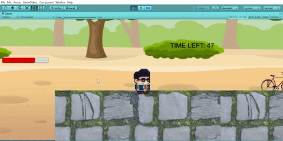

# Game Basic Information #

## Summary ##

** The Struggle **

Created by Isabel Kalogiannis, Marcos Alcantar, Jill Parodi, Margaret Sit, and Leander Ty

Have you ever experienced those bike traffic-ridden, hectic campus commutes to your classes during your time at UC Davis? Well, through this game you will experience and relive those moments again! Rush to class as you avoid bikers and squirrels in this 2D platformer that was inspired by the classics, like Super Mario Bros! Beat the timer and make it to class on time to avoid losing those precious clicker points and save your grade!

## Gameplay explanation ##

The controls are explained below. You have to run instead of walk to be able to pass certain parts of the level such as  
shift-run-jumping to platforms to be able to jump over the wall.  You have to throw books using ctrl or the left mouse button to fight squirrels and the boss before the end of the level.

# Main Roles #

Your goal is to relate the work of your role and sub-role in terms of the content of the course. Please look at the role sections below for specific instructions for each role.

Below is a template for you to highlight items of your work. These provide the evidence needed for your work to be evaluated. Try to have at least 4 such descriptions. They will be assessed on the quality of the underlying system and how they are linked to course content. 

*Short Description* - Long description of your work item that includes how it is relevant to topics discussed in class. [link to evidence in your repository](https://github.com/dr-jam/ECS189L/edit/project-description/ProjectDocumentTemplate.md)

Here is an example:  
*Procedural Terrain* - The background of the game consists of procedurally-generated terrain that is produced with Perlin noise. This terrain can be modified by the by the game at run-time via a call to its script methods. The intent is to allow the player to modify the terrain. This system is based off the component design pattern and the procedural content generation portions of the course. [The PCG terrain generation script](https://github.com/dr-jam/CameraControlExercise/blob/513b927e87fc686fe627bf7d4ff6ff841cf34e9f/Obscura/Assets/Scripts/TerrainGenerator.cs#L6).

You should replay any **bold text** with your own relevant information. Liberally use the template when necessary and appropriate.

## User Interface

**Describe your user interface and how it relates to gameplay. This can be done via the template.**

## Movement/Physics

The implementation of the movement conventions was closely tied to how the input was implemented. We used Unity’s 2D physics system and tweaked the values of variables to accomplish a weighty feel to the character’s movement while also letting the player have fair amount of control. By using what we learned from the command pattern exercise in our first assignment, we were able to separate movement for each button input. This allowed us to focus on implementing a jump that could be controlled based on how long the jump button was held. To implement that, we used a [video tutorial](https://www.youtube.com/watch?v=7KiK0Aqtmzc) and we altered the values of the player’s rigidbody velocity when we detected vertical movement. We made the jump up take longer than the fall to give a controlled jump with a weighty feel just like how Mario games do so. The gravity scale on the player was also doubled to make the falling faster.

We limited the player to one jump, and to prevent any more jumps from being inputted and breaking the movement conventions, we created states to handle inputs for different states. The three basic states included being grounded, jumping, and getting hurt. The hurt state was necessary to add knockback movement to indicate to the player that damage was dealt. Applying knockback was simply a matter of pushing the player away from an enemy using the rigidbody’s AddForce function, along with setting the velocity to 0 when hit and when landing on the ground again to keep the movement consistent. 

For handling collisions between the player and the level, we used the Box Collider 2D component paired with the rigidbody and we added a physics material to the player that gave it a friction value of 0 to allow some slipping when landing from jumps. This also allowed the player to do full jumps when also pushing against a wall. However, this resulted in a bug that we weren’t able to address in time that caused to player to keep slipping along the ground when pushed by an enemy. 

Better Jump Video Tutorial: https://www.youtube.com/watch?v=7KiK0Aqtmzc

## Animation and Visuals

**List your assets including their sources, and licenses.**

**Describe how your work intersects with game feel, graphic design, and world-building. Include your visual style guide if one exists.**

## Input

**Describe the default input configuration.**

**Add an entry for each platform or input style your project supports.**

## Game Logic (Leander)

### General Game Logics:

#### Scene Manager(GameManager.cs)

The scene management was done using a singleton class in the GameManager.cs. As a singleton class and not a monobehaviour, the manager could exists outside a scene and would survive changes in the scene. The game manager used the scene management unity system to facilitate scene changing.

A scene change would be called using:

GameManager.Instance.ChangeScene("Scene Name");

##### Timeout

For the win and lose screen, a timeout.cs script is attached to the main cameras of each scene. It switches back to the main menu after a certain time using the changescene call.

#### Health Manager(HealthManager.cs) 

The health manager utilized the publisher-subscriber model. It contains a dictionary private field that takes a integer key and a double health value. This holds the health of every game object that would need a health irrespective if they are an ally or an enemy. 

To add health to a game object, do the following steps:

1. In the gameobject, add a private field with the Health Manager Type. Example: private HealthManager healthManager;

2. In the Awake() function, find and save the healthManager in your file system to the newly created field. Example:        this.healthManager = GameObject.FindGameObjectWithTag("Manager").GetComponent<HealthManager>();
  
3. Add a integer private field so we can save the key returned by the Add(double desiredhealth) of the HealthManager class. Example:        key = this.healthManager.Add(Health);
This key will a unique identifier to the game object and it will be used for interacting with the health manager.

4. Finally, dealing damage to the key holder would occur by calling the health manager function called Damaged(int key,double damage).
Example: this.healthManager.Damaged(key, 5.0);
Damaged() will return the current health.
If the damage kills the keyholder, the key/damage pair will be deleted from the dictionary and 0 will be returned as current health.

### Projectile Controllers:

#### BossProjectileController & ProjectileController(Players)

The projectile controllers are attached to each projectile prefabs. Both have the same functions. The controllers have a lifeTime and a currentLife fields that initialized in the awake function and also serve the purpose of dictating the life span of the projectile. The Update() function interates over the currentLife field. Once it reaches the lifeTime field in value, the projectile is deleted. The projectiles also have a OnTriggerEnter2D function that detects collision with the opposite faction(Player detects for Enemy and vice versa) or ground. If it is triggered, the object is destroyed. I decided to do a projectile script so the projectiles could timeout when not needed anymore.

### Boss Mechanics:

The Boss is controlled by the BossController. The controller handles the boss attacks, damage detection, and animations. The Boss uses the health manager to manage its health. Damage detection is done with trigger collision and the use of tags.

#### Attack Descriptions:

Each attack follows its own timer to decide when to activate.

##### Attack 1: AOE Spread Attack

##### Attack 2: Single Large Swing Attack

##### Attack 3: Slow, but deadly lightning Attack
Attack 3 does a delay attack. With an attack cycle of 2 sec, the attack saves the position at time 0, then at time 2, it attacks at the position.

#### Boss Enter/Exit

The Boss also utilizes a Boss Room Controller. Around the boss, there is a box collider 2D that detects if the player has entered the area. In the BossRoomController, the OnTriggerEnter and OnTriggerExit functions sets the value of a boolean field. The BossController accesses this field to check if it can set its own Active field. If the Active field is set to true, the Boss attacks. If its false, the boss does not. This check is done on every update.

#### Miscellaneous Contribution:

##### Triggers and Stuff:

###### Win Trigger(WinTrigger Prefab w/ script)

The win trigger uses a single trigger collider that detects the player. After detecting the player, the change scene function is called.

###### Fall Trigger(FallDetector w/ script)

The fall trigger uses a single trigger collider that detects the player. After detecting the player, the change scene function is called.

# Sub-Roles

## Audio

For audio, we chose to have retro-style 8-bit sound effects to compliment the visual style of the game. These type of sound effects are closely associated to older arcade games, including classic platformers like Super Mario Bros., Metroid, and Castlevania. We thought the pixel art assets and these type of sound effects would compliment each other well. They helped give the players an arcade-like experience and the feeling that they’re playing a game in the style of these old classics. The background music was a short and fun-sounding bossa nova loop that we felt would add a little more personality. 

To implement the audio system, we created an audio manager script that was attached to a centralized game object that contained other manager scripts for health, the HUD, and UI buttons. The audio manager contains a list of all of the audio clips for the sound effects and the music in the game. This made it easier to search the list and play any sound that we wanted to from any other scripts in the game. The list was made public so that we could add the sounds manually and change their properties, like volume and pitch, in the editor. To implement this list of sounds, we also created a wrapper class for Unity’s audio clips to allow us to change their properties in the editor. This manager implementation was taken from an online video tutorial.

References and Assets:

Video tutorial used for Audio Implementation: https://www.youtube.com/watch?v=6OT43pvUyfY&t=40s

Sound Effects (Created by ZapSplat, Standard Liscence): https://www.zapsplat.com/page/11/?s=footstep&post_type=music&sound-effect-category-id

Win Sound Effect: https://freesound.org/people/maxmakessounds/sounds/353546/

Lose Sound Effect: https://freesound.org/people/AdamWeeden/sounds/157218/

Bossa Nova Theme Loop: https://freesound.org/people/Mrthenoronha/sounds/371844/

## Gameplay Testing

|Timestamp|What did you enjoy?          |What did you not enjoy?|What do you want to add?                     |How were the controls?                                                                   |
|---------|-----------------------------|-----------------------|---------------------------------------------|-----------------------------------------------------------------------------------------|
|2019/06/07 2:23:33 PM MDT|Really like the feel of the game jump and how you can move while in the air left and right. Being able to jump further while boosting is also a neat addition.|Mainly the UI. The UI needs to be a place where it is more noticable/positioned well.|-Maybe a blocking animation to reduce damage- some of the projectiles are difficult to dodge.  -Maybe have a state where you are temporarily invincible for a few seconds upon getting hit, and where you can move around freely.|Excellent! :)                                                                            |
|2019/06/07 2:26:40 PM MDT|The davis theme              |controls were lowkey hard to remember|nothin                                       |okayyy                                                                                   |
|2019/06/07 2:30:49 PM MDT|The sound design and platforming|The combat             |More levels                                  |I had little issue with the controls                                                     |
|2019/06/07 2:39:47 PM MDT|THE SQUIRRELS! and bikes and gameplay (jump and shoot feels good)|Health may seem low, but it makes it challanging so it's fun. |Difficulty selection (based on how much health you start off with)|Loved it.                                                                                |
|2019/06/07 2:42:02 PM MDT|Player and camera movement was smooth|The player health bar was too out of the way. |Good so far                                  |I wish the shoot and dash controls were remapped as using the pinky was a little awkward.|
|2019/06/07 2:44:46 PM MDT|gameplay                     |the big squirrel, the dash didn't feel dash|visual on the dash                           |good!                                                                                    |
|2019/06/07 2:48:31 PM MDT|The sprinting mechanic was nice|Maybe add knockback/invulnerability after being hit by an enemy .|Read above                                   |Controller would be interesting. but felt good on here                                   |
|2019/06/07 2:51:31 PM MDT|I loved the visuals, and the game feels quite smooth|Falling off theedge to the left, and the random lines on the screen|More enemies, maybe another firing pattern.  |The controls are pretty intuitive, and responsive                                        |
|2019/06/07 2:56:57 PM MDT|Gameplay was smooth and I liked the theme|Healthbar / UI not very visible|More levels                                  |Intuitive                                                                                |
|2019/06/07 3:02:27 PM MDT|I enjoyed the fluidity of the movement especially the jump|Didn't like the attack being the ctrl button|Adding controller support would be fun.      |Didn't like the attack button                                                            |
|2019/06/07 3:05:52 PM MDT|variable jump height         |controlling everything with one hand|just more platform content                   |using shift was a little tricky                                                          |

### Summary:

The game was generally reviewed well. While a little challenging, the game feel and theme made losing/winning enjoyable. The main complaints were concerned with the UI and control scheme. The UI was hard to see and the controls were, well, hard to control. Reviewers also requested for an expanded level and a variation in attacks and enemies. 

## Narrative Design

**oDocument how the narrative is present in the game via assets, gameplay systems, and gameplay.** 

## Press Kit and Trailer

**Include links to your presskit materials and trailer.**

**Describe how you showcased your work. How did you choose what to show in the trailer? Why did you choose your screenshots?**

## Game Feel

**Document what you added to and how you tweaked your game to improve its game feel.**
