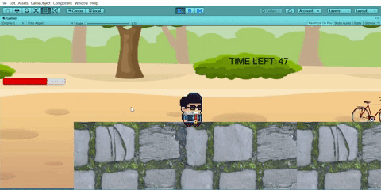

# ECS189L Game Project - "The Struggle"

# Description of Game Project

In this project, you will be designing and creating a game in Unity in teams of 5. While you will be responsible for designing the overall direction of your game, you will be given the following constraints:
* Each team member will have a role and a sub-role.
* Each team member will be responsible for creating at least one gameplay system.
* Each team member will be responsible for describing their work in your team's design document. 
* All roles and sub-roles must be assigned across your team's members.
* Your game, assets, source code, and project files will be placed in a publicly-accessible GitHub repository.

# Grading

The project will be graded on a 100 point scale with the follow weights:
* Main Role
  * 30 Implementation
  * 10 Documentation
* Sub-Role
  * 20 Implementation
  * 10 Documentation
* 30 Team score of completed game.

# Submission Information

All of your project materials are due by ~~Friday, June 7th at 1:00 PM~~ Monday, June 10th at 8:00 AM. A portion of your team score points will assessed during the final meeting period on Friday, June 7th at 1:00 PM.

Submissions will be taken from the [team registration spreadsheet](https://docs.google.com/spreadsheets/d/1XJzAVba3Xv8tIHESsGGHAMc50W8S9ytrXSrFoPadhlU/edit?usp=sharing) via your teams GitHub repository link. Your project code

Your repository should include the following .gitignore file in the rood directory of the project: https://gitignore.io/api/osx,unity,linux,windows

# Team Member Roles

Each team member must take on one main role and one sub-role. You will create the gameplay systems or complete the design tasks for your roles as well as provide the requested per-role documentation. Each team member must document the gameplay systems and software design patterns they used for their portion of the project.

## Main Roles

The following are the main roles and their basic descriptions

### User Interface - (Isabel)

In this role, you are responsible for the user interface elements of the game. This typically includes the contents of the heads up display or HUD. This traditionally comprises gameplay status information such as player character health, score, resources like magic points or gold,  and time-keepers. This is also responsible for menu and credit screens. You are responsible for documenting the various UI elements you implement and how they interact with the changing state of the game.

### Movement/Physics - (Marcos)

The implementation of the movement conventions was closely tied to how the input was implemented. We used Unity’s 2D physics system and tweaked the values of variables to accomplish a weighty feel to the character’s movement while also letting the player have fair amount of control. By using what we learned from the command pattern exercise in our first assignment, we were able to separate movement for each button input. This allowed us to focus on implementing a jump that could be controlled based on how long the jump button was held. To implement that, we used a [video tutorial]  (https://www.youtube.com/watch?v=7KiK0Aqtmzc) and we altered the values of the player’s rigidbody velocity when we detected vertical movement. We made the jump up take longer than the fall to give a controlled jump with a weighty feel just like how Mario games do so. The gravity scale on the player was also doubled to make the falling faster.

We limited the player to one jump, and to prevent any more jumps from being inputted and breaking the movement conventions, we created states to handle inputs for different states. The three basic states included being grounded, jumping, and getting hurt. The hurt state was necessary to add knockback movement to indicate to the player that damage was dealt. Applying knockback was simply a matter of pushing the player away from an enemy using the rigidbody’s AddForce function, along with setting the velocity to 0 when hit and when landing on the ground again to keep the movement consistent. 

For handling collisions between the player and the level, we used the Box Collider 2D component paired with the rigidbody and we added a physics material to the player that gave it a friction value of 0 to allow some slipping when landing from jumps. This also allowed the player to do full jumps when also pushing against a wall. However, this resulted in a bug that we weren’t able to address in time that caused to player to keep slipping along the ground when pushed by an enemy. 

Better Jump Video Tutorial: https://www.youtube.com/watch?v=7KiK0Aqtmzc

### Animation and Visuals - (Jill)

As the team's master of visuals, you are responsible for implementing the basic animation scripts used by objects in your game. You are also tasked with setting the visual style and are the primary person responsible for finding the art assets to use in your game. You will document the animation systems used, a guide to the visual style of your game, and to document the sources and licenses of the art assets used in your game. 

### Input - (Margaret)

In this role, you will be responsible for managing the input methods for your game. You should design your game to be used with either keyboard and mouse or a game controller. If you would like to excel in this role, you can add additional input control schemes for mobile devices. You will document what the inputs are and how they affect each of the game modes (e.g. menu, main gameplay, inventory screens, credits, etc.) and how they interact with the game work and UI/HUD.

### Game Logic - (Leander)

In most projects, this will be the most complicated role as it is a point of integration for nearly all of the gameplay systems. Traditionally, most of the game logic is placed in a game manager singleton and is referenced as needed by other scripts. It is the job of your team's game logician to manage the various game states (i.e. current level, main menu, main gameplay mode) and data (i.e. time remaining, quest completion status, references to all active enemies and items).  You will document what game states and game data you managed and what design patterns you used to complete your task. Charts are a great way to visually explain how parts of your game logic interact with the other gameplay systems.

## Sub-Roles

### Audio - (Marcos)

For audio, we chose to have retro-style 8-bit sound effects to compliment the visual style of the game. These type of sound effects are closely associated to older arcade games, including classic platformers like Super Mario Bros., Metroid, and Castlevania. We thought the pixel art assets and these type of sound effects would compliment each other well. They helped give the players an arcade-like experience and the feeling that they’re playing a game in the style of these old classics. The background music was a short and fun-sounding bossa nova loop that we felt would add a little more personality. 

To implement the audio system, we created an audio manager script that was attached to a centralized game object that contained other manager scripts for health, the HUD, and UI buttons. The audio manager contains a list of all of the audio clips for the sound effects and the music in the game. This made it easier to search the list and play any sound that we wanted to from any other scripts in the game. The list was made public so that we could add the sounds manually and change their properties, like volume and pitch, in the editor. To implement this list of sounds, we also created a wrapper class for Unity’s audio clips to allow us to change their properties in the editor. This manager implementation was taken from an online video tutorial.

References and Assets:

Video tutorial used for Audio Implementation: https://www.youtube.com/watch?v=6OT43pvUyfY&t=40s

Sound Effects (Created by ZapSplat, Standard Liscence): https://www.zapsplat.com/page/11/?s=footstep&post_type=music&sound-effect-category-id

Bossa Nova Theme Loop: https://freesound.org/people/Mrthenoronha/sounds/371844/

### Gameplay Testing - (Leander)

As the gameplay tester, you are responsible for having 10 non-team members playtest your game. You fill out the Observation and Playtester Comments form for each of your play testers and describe the results in the design document (after you share the results with your tea, of course!). 

### Narrative Design - (Jill)

You are responsible for designing and embedding the story of your game into the gameplay experience. While your team may collective decide on the story, you will make it present in the game. You will document how the narrative is present in the game via assets, gameplay systems, and gameplay.

### Press Kit and Trailer - (Isabel)

You are responsible for creating a press kit for your game that includes screenshots and a 1-minute trailer. You should document the choices you made in the press kit and the goals of your trailer in the design document.

### Game Feel - (Margaret)

In this role, you are responsible for using what we learned in class about game feel to enhance your game's playability. You will document what you added to and how you tweaked your game to improve its game feel.

